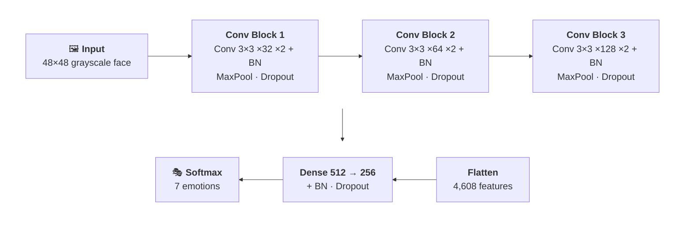

<div align="center">


**A deep convolutional neural network that reads emotions from faces — and shows you exactly *where* it looked.**


<br>


*Grad-CAM heatmaps: red regions are what drove each prediction — eyes and brows for anger, the smile for happiness, the open mouth for surprise.*

</div>

---

## ✨ Highlights

- 🧠 **Deep CNN** — 6 convolutional layers, ~2.78M parameters, trained on 28,709 face images
- 🎯 **62.5% accuracy** on the full 7,178-image held-out test set — *near the ≈65% human benchmark on FER-2013, where random guessing is 14%*
- 🔍 **Explainable AI** — Grad-CAM heatmaps and layer-by-layer activation maps reveal *why* the network decided what it decided
- 📊 **Honest evaluation** — full confusion matrix, per-class precision / recall / F1, no cherry-picking

---

## 📈 Results

<div align="center">

<br><br>

</div>

**What the matrix reveals** — the model's mistakes are *human* mistakes:
- 😠 **"Disgusted" gets mistaken for "angry"** 56% of the time (they share furrowed brows — and only 436 training images existed for disgust)
- 😨 **"Fearful" bleeds into "sad" and "surprised"** — wide eyes are ambiguous at 48×48 pixels
- 😊 **"Happy" and "surprised" are nailed at 83%** — a smile and an open mouth are unmistakable signals

<details>
<summary>📋 <b>Full metrics table</b></summary>
<br>

| Emotion | Precision | Recall | F1-score | Test images |
|---|---:|---:|---:|---:|
| 😊 happy | 0.88 | 0.83 | 0.85 | 1,774 |
| 😲 surprised | 0.70 | 0.83 | 0.76 | 831 |
| 😐 neutral | 0.52 | 0.68 | 0.59 | 1,233 |
| 😠 angry | 0.52 | 0.59 | 0.56 | 958 |
| 😢 sad | 0.49 | 0.55 | 0.52 | 1,247 |
| 😨 fearful | 0.57 | 0.21 | 0.31 | 1,024 |
| 🤢 disgusted | 0.63 | 0.15 | 0.25 | 111 |
| **Overall** | | | **62.52%** | **7,178** |

</details>

---

## 🏗️ Architecture

VGG-style: three double-convolution blocks with batch normalization, followed by a two-stage dense classifier. Dropout at every block keeps 2.78M parameters honest.



---

## 🔍 Seeing Through the Network's Eyes

The notebook generates two kinds of interpretability visuals for any face:

| | |
|---|---|
| **Activation maps** | Feature maps from all 6 conv layers — watch raw pixels become edge detectors, then facial-feature detectors, layer by layer |
| **Grad-CAM** | Gradient-weighted heatmaps overlaid on the face — the regions that *caused* the prediction |

<div align="center">

</div>

---

## 🚀 Quickstart

```bash
git clone <this-repo>   # dataset ships via Git LFS
cd "Task 1"
pip install -r requirements.txt
jupyter lab Emotion_Detection_Code.ipynb   # → Run All Cells
```

No training needed — the notebook loads the pre-trained model and reproduces every number and image in this README in a few minutes on a laptop.

<details>
<summary>📁 <b>Project structure</b></summary>

```
├── Emotion_Detection_Code.ipynb   # The full pipeline, ready to run
├── models/
│   ├── best_emotion_model.keras   # ⭐ Best model (62.5%) — used by the notebook
│   ├── best_emotion_model.h5      # Same weights, legacy checkpoint format
│   ├── final_emotion_model.h5     # Last-epoch checkpoint (62.3%)
│   └── emotion_model.h5           # Early prototype
├── emotion_detection_model.h5     # Earlier 3-conv-layer model (56.2%)
├── train/  test/                  # FER-2013-style dataset, 7 classes (Git LFS)
├── activation_maps_output/        # Generated Grad-CAM + activation visualizations
├── assets/  Result/               # README banner, confusion matrix, metrics charts
└── requirements.txt
```

</details>

---

## 🗺️ Roadmap

- [ ] Class weighting / oversampling for `disgusted` and `fearful` — the single biggest accuracy lever
- [ ] Test-time augmentation (mirror + shift ensembling)
- [ ] Transfer learning from a face-pretrained backbone
- [ ] Real-time webcam demo with OpenCV

---

<div align="center">

**Built with TensorFlow/Keras · Visualized with Grad-CAM · Evaluated honestly**

*If this project caught your eye, the notebook is the fun part — open it and watch the network think.* 🧠

</div>
